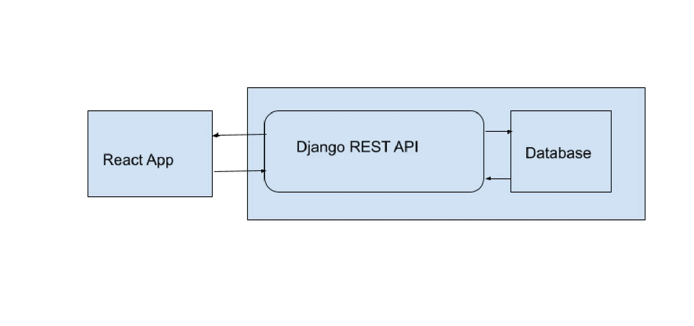
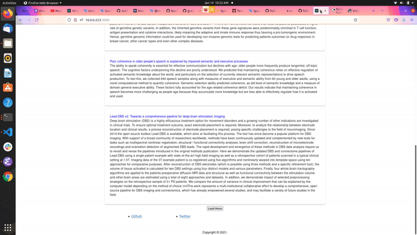

# full-stack-arxiv
I built a full stack web app for learning purposes.

## About

- I used an external API to seed the database; and
- I built a REST API to access the data from the front-end; and
- I built the front-end with React which renders the Data; and
- Added a page where the user can search for research papers by modifying the api -- created an end point for searched papers

## License
GNU
           
## architecture

## example 

The data are research papers; I manipulate the **title** and the **abstract** of 
the research paper.

# Installation
- `clone` this repo
- `cd` into the repo folder
- In on Terminal run `python3 manage.py runserver` from the `backend` folder
- In a separate terminal run `npm start` from the `frontend/arxiv` folder
